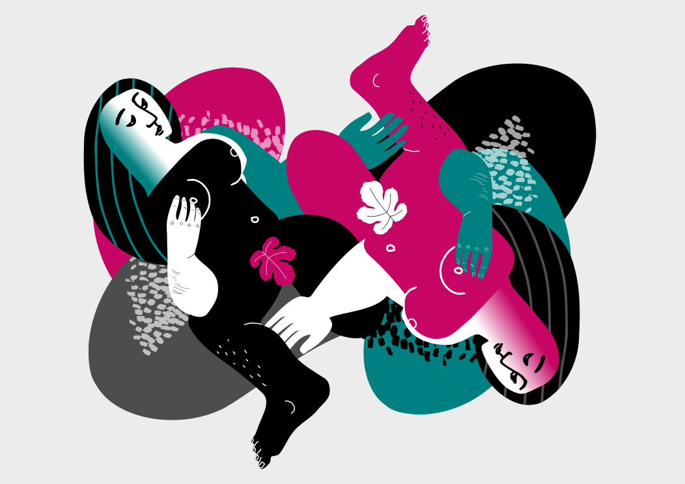

# No-Dotted-Line
Files for making an illustrated book on healthy consent.

These SVG illustrations are designed for layering & remixing. 
Some text suggestions are provided in the 'collections to download' folder as captions for the images. See below for further ideas on how you cn play with the images and contribute your own.

## Suggestions for playing with the images 
If you know how to use a vector graphics editor you could improve or add new graphics to the project. Would be nice if you are using a free libre open source software like Inkscape. It is cross platform software, meaning that it and you can install it to a computer that is using Windows, GNU/Linux or Mac operating systems. download it here: inkscape.org.

Some body shapes are a single path, others are made of a group of paths with different colours. To change colours of grouped paths in Inkscape, click on a body shape then SHIFT + CTRL + G to ungroup it, and edit each colour separately.

To create a 'cutout' of a shape for layering, put one path on top of another, select both, then Path > Difference will punch a hole in one which has the shape of the other.

## Host a sex ed session about healthy consent
You can use host a workshop using the content of the book: feel free to download the images, perhaps to make cut-outs which participants can rearrange. 

## To contribute your remixes
Please submit pull request to pageSpreads folder. Images should be in portrait or landscape format, A4 page size. Number your image file one greater than the highest page number already in the folder, in this format: page05.svg

If you think that the project is missing a category or any kind of content, feel free to open an issue to the GitHub repository of the project. It is quite easy and not a lot of tecnical skills is needed. You can find the repository here: https://github.com/elnornor/No-Dotted-Line/issues

### Credits
Your contributions will be licensed in a Creative Commons BYSA license, which gives you credit to your work, but at the same time permits other people to contribute to the project as well without asking for permission all the time.
Once the above text is finalized it could be added to the readme file of the project.

###Localization
If you are interested to translate the book in your language you can have a look at this folder with all the texts available: collectionsToDownload/texts

Once you have translated the texts in your language (many thanks btw), please open an issue here https://github.com/elnornor/No-Dotted-Line/issues and we will publish it.

